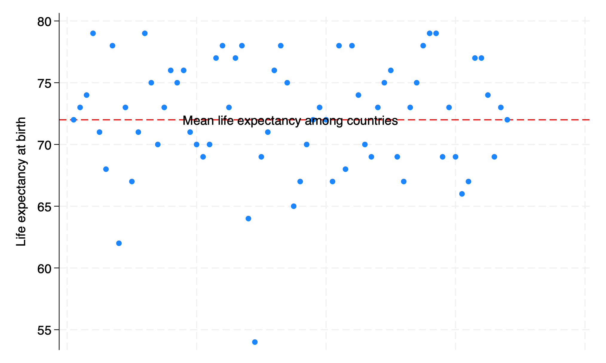

# How to embed Stata results in .html  

### Author, MD MPH

**Background:** 
A <u>user</u> downloads and installs a <u>system</u> of program files, mostly ado-files, which form the foundation of most of the commands 
used in Stata Programming. Using those commands and additional syntax written out sequentially in a do-file, the user creates 
well-formed instruction to Stata called a do-file script. Once the user runs this script, results are generated and displayed
in the results window, in a graph, or in a format (`.xlsx`, `.log`, `.dta`, `.docx`, `.md`, `LaTeX`, `.html`, etc). The `.html` file format is of specific 
interest since its the pathway to self-publication. To illustrate how this may be achieved in Stata, we hereby introduce the `dyndoc`
command. 

**Methods:** 
We created a [do-file](https://raw.githubusercontent.com/jhustata/livre/main/filename.do) and populated it with this abstract using [markdown](https://en.wikipedia.org/wiki/Markdown) language. Anything 
in this document that is not ordinary text including `<<dd_version: 2>>`, `<<dd_do:nooutput>>`, `<</dd_do>>`, `<<dd_display: c(N)>>` is a 
[markup](https://en.wikipedia.org/wiki/Markup_language#:~:text=A%20markup%20language%20is%20a,content%20to%20facilitate%20automated%20processing.). 
Results that might be numeric, string, alphanumeric, or formatted as macros are embeded at these markedup points. We then saved this 
document using the file extension .do; however, any text file extension will work (.txt, .md, .do, etc). To the `pwd` where we saved
this text file, we added a cascading style sheet [stmarkdown.css](https://raw.githubusercontent.com/jhustata/livre/main/stmarkdown.css) and [header.txt](https://raw.githubusercontent.com/jhustata/livre/main/header.txt) to enhance the aesthetic of our .html file. Finally, we typed the 
following command into the Stata command window: `dyndoc filename.do, saving(filename.html) replace`. In the key analysis, $Y  = \beta_0   +  \beta_1 X$, where $Y$ is life expectancy at birth in years, the outcome or dependent variable; $X$ is the country, the predictor or independent variable being tested.  

```stata
. webuse lifeexp, clear 
(Life expectancy, 1998)

. encode country, gen(Country)

. quietly sum lexp

. qui local lexp_mean: di %3.0f r(mean) 

. quietly sum Country

. qui local Country_mean: di r(mean)  

. twoway scatter lexp Country, ///
>    xscale(off) ///
>    yline(`lexp_mean', ///
>       lc(red) ///
>       lp(dash) ///
>    ) ///
>    text(`lexp_mean' `Country_mean' "Mean life expectancy among countries")

. graph export lexp_bycountry.png, replace 
file /Users/d/Desktop/lexp_bycountry.png saved as PNG format

. 
end of do-file

. 

```


      
  
```stata
. qui {

.

```

```stata
. display c(N) 
68

. display c(k)  
6

. list in 1/5  

						
    region	            country	    popgro~h	 lexp	    gnppc  safewa~r	
						
1.  Europe & C. Asia	Albania	       1.2	        72	    810	    76	
2.  Europe & C. Asia	Armenia	       1.1	        74	    460	    .	
3.  Europe & C. Asia	Austria	       .4	        79	    26830   .	
4.  Europe & C. Asia	Azerbaijan    1.4	        71	    480	    .	
5.  Europe & C. Asia	Belarus	       .3	        68	    2180    .	
						

. 
end of do-file

. 

```

**Results:** 
We identified the newly created .html file in our folder and opened it to compare its format to this markdown file. And we saw all that
we had made, and behold, it was very good. Ghastly macros in the original markdown language now appeared as neatly formatted
results. There were 68 observations and 6 observations in the analyzed dataset. Average life expectancy of all countries, $\beta_0$, was 72 years. Difference in life expectancy among <u>adjacent</u> countries, $\beta_1$, showed no trend or pattern and was 0.002 year, essentially $zero$, and $p = .95$

**Conclusions:** 
In walking you through syntax, do-file creation, queued commands, generated results, through to embedding neatly formatted output in
.html, we believe you now have a solid sense of all that Stata has to offer you. These ideas can be generalized to embedding results 
in .xlsx, .log, .dta, .docx, etc. 


